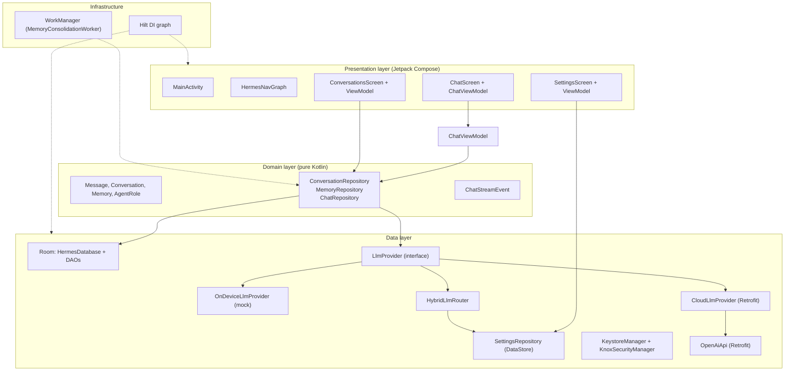
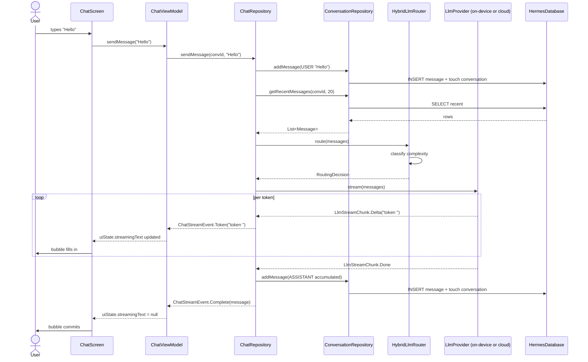
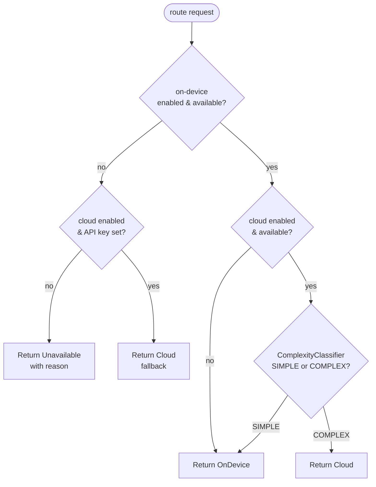
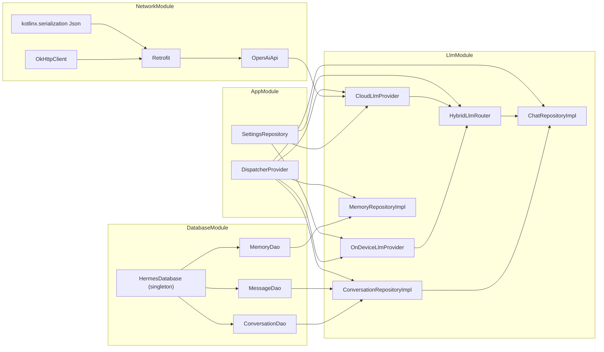
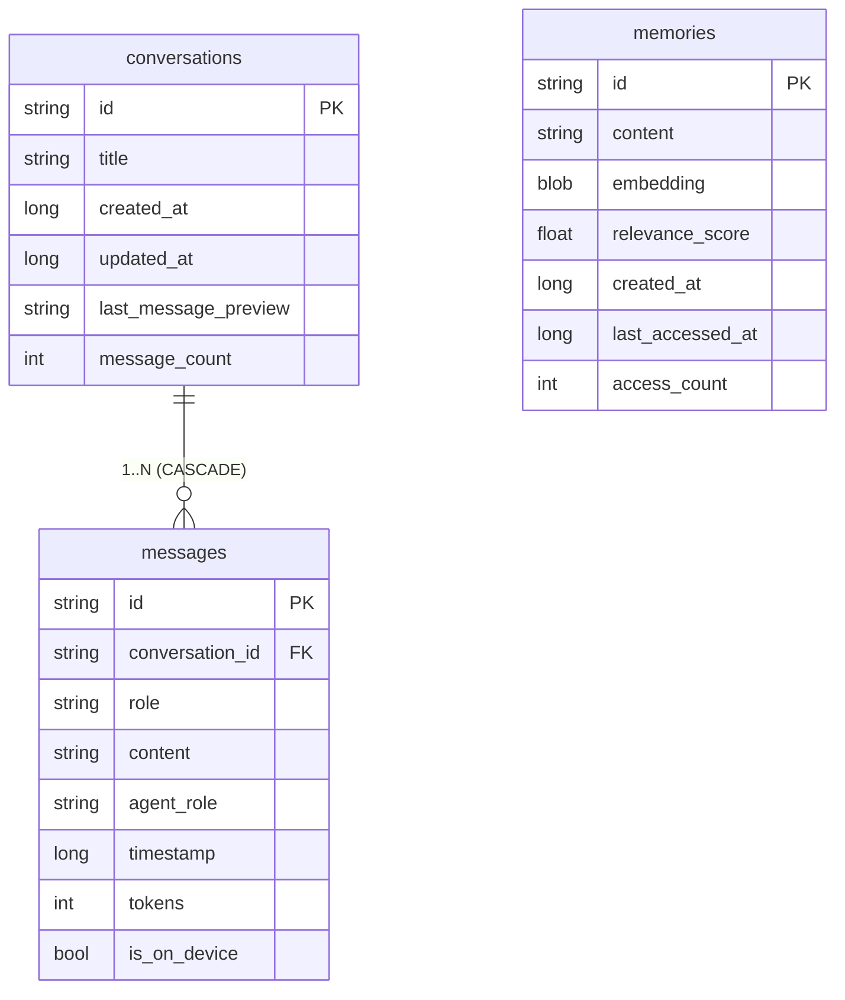
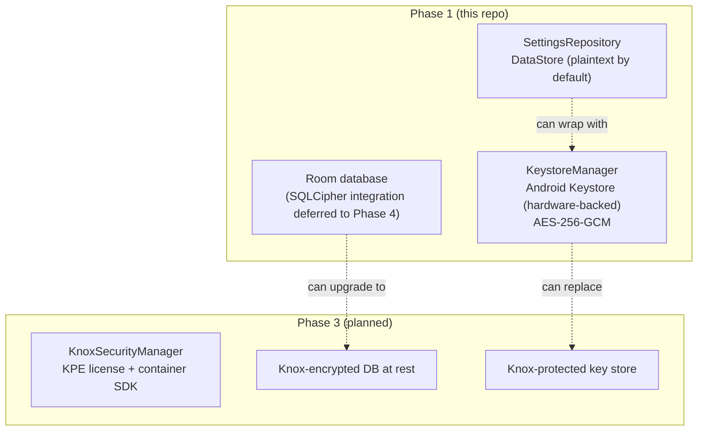
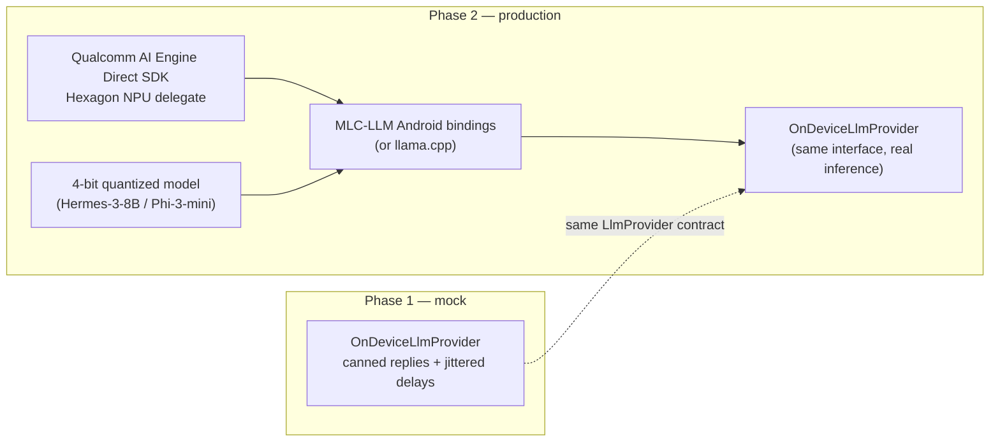

# Architecture

This document describes the runtime architecture of the Hermes Agent Android
app as shipped in Phase 1, and how it maps back to the technical plan. The
diagrams are Mermaid; GitHub and most IDEs render them inline.

## 1. Layered architecture

The app follows a strict layered design with a single allowed dependency
direction: UI → domain ← data. Domain is pure Kotlin (no Android imports);
data implements the domain contracts; UI consumes them through ViewModels.

**Mapping to the plan:**

| Plan section        | Where it lives in this repo                                      |
|---------------------|------------------------------------------------------------------|
| 3.1 High-level arch | Layered structure above                                         |
| 3.2 Orchestration   | `data/llm/HybridLlmRouter.kt` (Phase 2 expands this)            |
| 3.3 Plugin system   | Deferred to Phase 3                                              |
| 4.2 Tech components | `gradle/libs.versions.toml` (one entry per row of plan Table 3) |
| 5.1 NPU acceleration| `data/llm/OnDeviceLlmProvider.kt` (mock; Phase 2 swaps in MLC-LLM) |
| 5.2 Memory mgmt     | `data/local/HermesDatabase.kt` + `data/settings/UserSettings.idleUnloadMinutes` |
| 5.4 Battery optim   | `work/MemoryConsolidationWorker.kt` + lazy-load in OnDeviceLlm  |
| 6.1 Multi-agent     | `domain/model/AgentRole.kt` (enum declared, orchestration in Phase 2) |
| 6.2 Memory system   | `data/repository/MemoryRepositoryImpl.kt` (keyword search in Phase 1, ANN in Phase 2) |
| 6.3 RAG pipeline    | Deferred to Phase 2                                              |
| 6.4 Feature matrix  | P0 items shipped (mock or wired); P1/P2 deferred                 |

## 2. Chat send flow

The diagram below traces a single user message from the input bar through
persistence, routing, streaming inference, and back to the UI.

Key design properties of this flow:

- **Cold flow.** `ChatRepository.sendMessage` returns a `Flow<ChatStreamEvent>`
  that is only collected while the ViewModel holds a scope. Cancelling the
  ViewModel job (via the stop button) cancels the upstream provider stream
  too.
- **Persistence is the source of truth.** The streamed tokens are accumulated
  in-memory in the repository, then a single `Message` row is written on
  `Done`. The UI never holds the canonical copy; Room's Flow notifies the
  ViewModel of the new message independently.
- **Errors are surfaced, not thrown.** A mid-stream error emits
  `ChatStreamEvent.Error` and terminates the flow. Any tokens already
  emitted remain visible to the user; the partial reply is *not* persisted.

## 3. LLM routing decision tree

The router picks the provider per request. The heuristic is intentionally
simple in Phase 1; Phase 2 will replace it with a lightweight on-device
intent classifier.

The classifier (in `data/llm/ComplexityClassifier.kt`) flags a request as
COMPLEX when:

- prompt length > 400 chars, OR
- prompt contains any trigger word (`plan`, `compare`, `summarize`, `design`,
  `brainstorm`, `draft`, `write a long`, `explain in detail`, `step by step`,
  `multi-step`, `evaluate`, `critique`, `outline`, `analysis`, …).

This mirrors Section 5.1 of the plan: "simple queries are handled entirely
on-device with zero latency from network calls; complex reasoning tasks are
routed to cloud LLM endpoints."

## 4. Dependency injection graph

Hilt wires the entire object graph at compile time. The four DI modules
(`AppModule`, `DatabaseModule`, `NetworkModule`, `LlmModule`) live in
`di/` and together provide every singleton the app needs.

## 5. Persistence schema (Phase 1)

Room schema v1. Phase 2 will add `sqlite_vss` virtual tables and a
`documents`/`document_chunks` pair for the RAG pipeline.

Indexes:

- `conversations(updated_at)` — drives the "most recent first" ordering on
  the conversations list.
- `messages(conversation_id)` — point lookups by parent conversation.
- `messages(conversation_id, timestamp)` — supports the recent-window query
  used to build LLM prompts.

## 6. Security model

Phase 1 ships two security primitives; both are designed to be drop-in
replaced by Samsung Knox equivalents on Knox-capable devices in Phase 3.

Privacy-first defaults (Section 2.3 of the plan):

- Conversations and memories are **excluded from cloud backup** via
  `xml/backup_rules.xml` and `xml/data_extraction_rules.xml`.
- The cloud API key, if supplied, is stored in DataStore. Phase 4 will wrap
  it with `KeystoreManager.encrypt(...)` before persisting.
- The cloud provider refuses to call out if `cloudEnabled` is false or the
  API key is blank — see `CloudLlmProvider.isAvailable()`.

## 7. What replaces the on-device mock in Phase 2

The mock provider in `data/llm/OnDeviceLlmProvider.kt` honors the full
`LlmProvider` contract so the rest of the app can be built and exercised
today. Phase 2 will swap in the real runtime behind the same interface:

The public surface (`complete`, `stream`, `isAvailable`, `model`, `name`,
`isOnDevice`) does not change. The `HybridLlmRouter`, `ChatRepositoryImpl`,
and the rest of the app are unaware of the swap.
